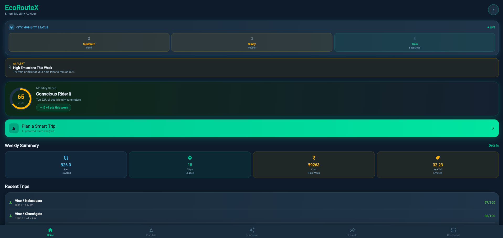
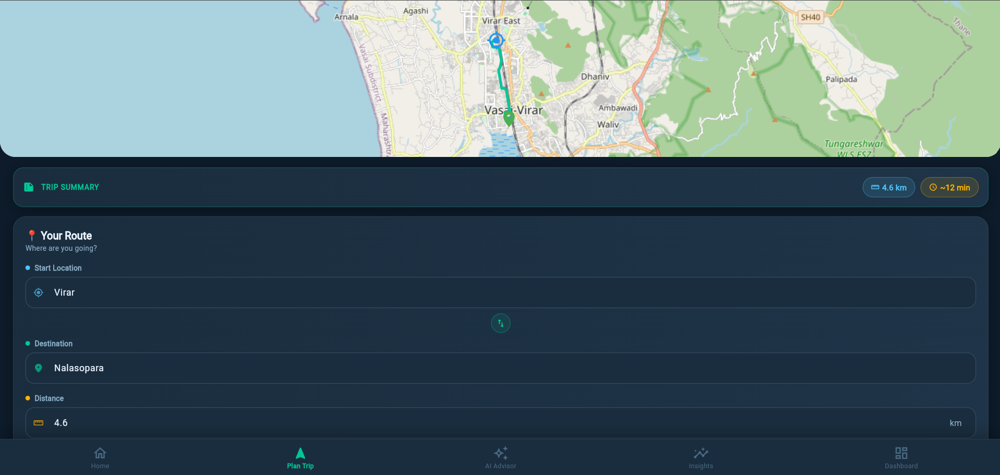
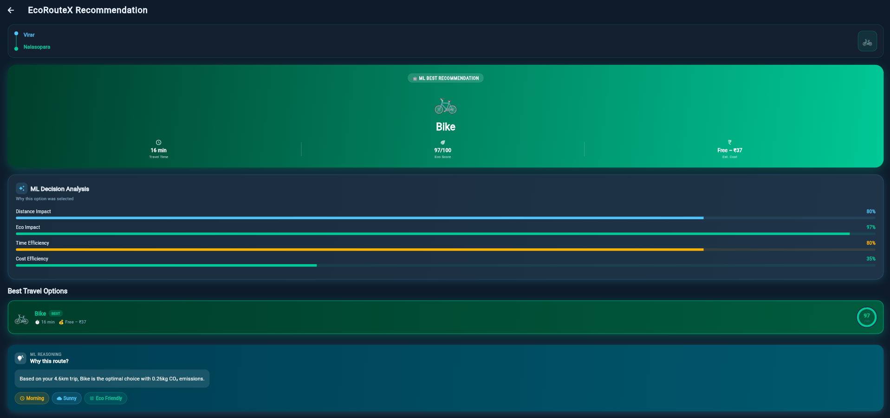
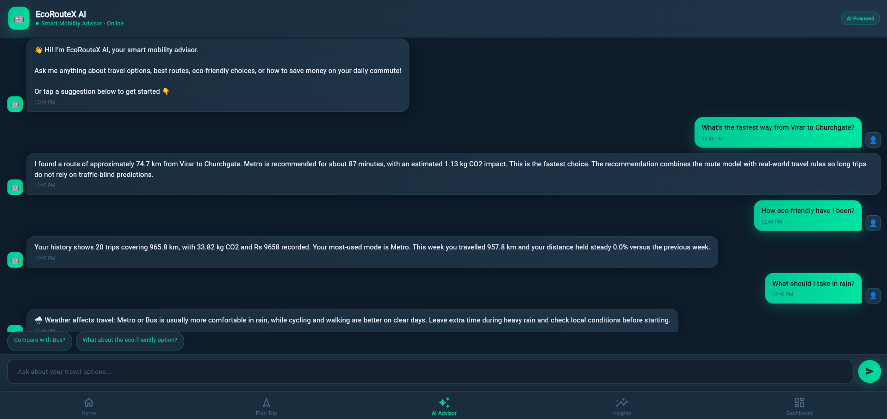
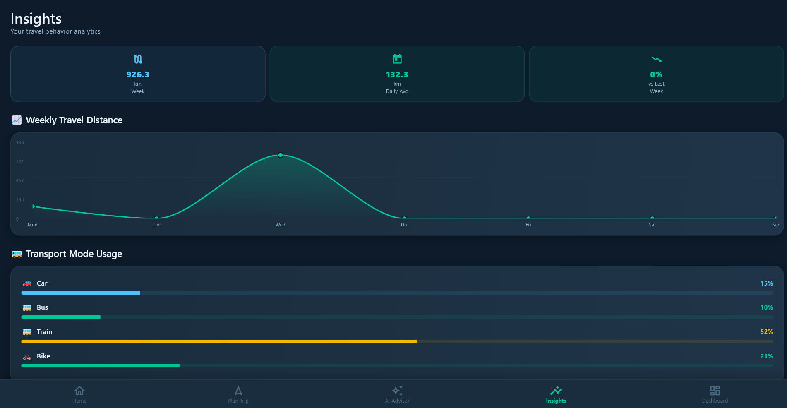
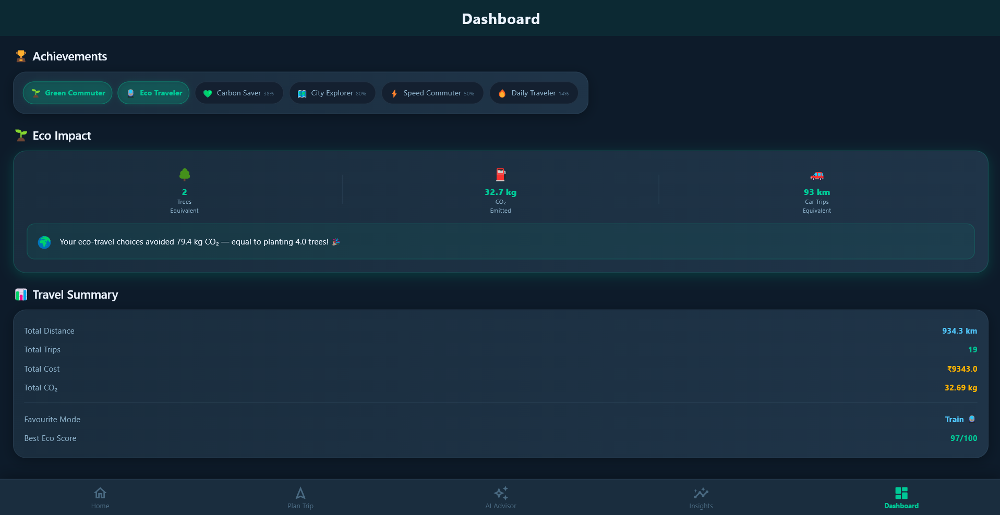
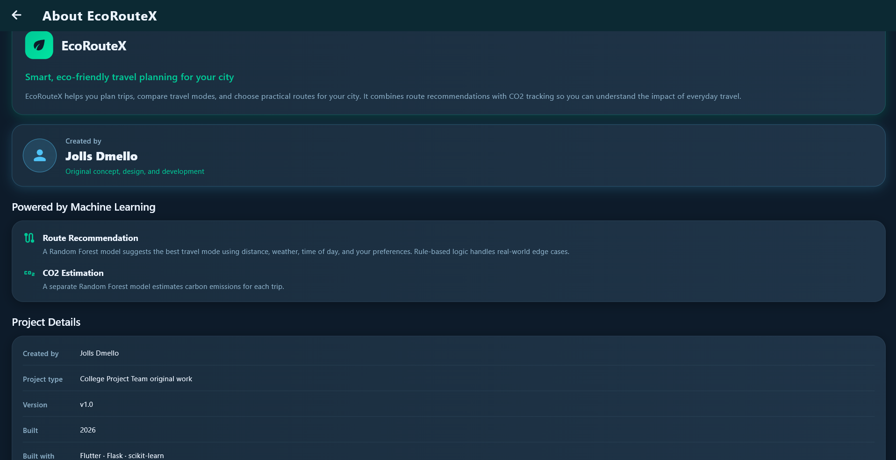

# EcoRouteX

EcoRouteX is a full-stack smart mobility application that helps users plan sustainable trips, compare transportation modes, estimate travel time and CO₂ emissions, and track their mobility habits.

The application combines **Flutter, Flask, Machine Learning, route APIs, and analytics** to provide personalized and eco-conscious travel recommendations.

## Features

* 🗺️ **Smart Trip Planning**

  * Enter origin and destination
  * Location search using Photon
  * Road distance and route geometry using OSRM
  * OpenStreetMap-based route visualization

* 🤖 **ML-Powered Transport Recommendation**

  * Recommends suitable transportation modes based on trip conditions
  * Considers distance, estimated duration, weather, time of day, and user preference
  * Supports Car, Bus, Metro, Bike, Walk, and Auto

* 🌱 **CO₂ Emission Prediction**

  * Machine learning model estimates trip-level CO₂ emissions
  * Generates an eco score based on predicted emissions

* 💰 **Cost & Duration Estimation**

  * Estimates transportation cost
  * Calculates travel duration using backend route logic
  * Supports fastest, cheapest, and eco-friendly preferences

* 📊 **Mobility Analytics**

  * Weekly trips and distance
  * CO₂ impact
  * Transportation mode distribution
  * Mobility score
  * Eco trends

* 🧠 **AI Mobility Advisor**

  * Provides route-aware travel advice
  * Answers questions about cost, CO₂, transportation modes, weather, and travel habits
  * Uses trip history and mobility statistics for personalized responses
  * Includes a local fallback advisor

* 🏆 **Achievements & Progress**

  * Tracks travel activity
  * Eco progress
  * Levels, badges, and streaks

* 💾 **Trip History**

  * Stores completed trip information
  * Maintains travel statistics for analytics and personalization

---

## Technology Stack

| Area             | Technology                  |
| ---------------- | --------------------------- |
| Frontend         | Flutter, Dart               |
| Backend          | Python, Flask               |
| Machine Learning | Scikit-learn                |
| Data Processing  | Pandas                      |
| Data Storage     | CSV                         |
| Geocoding        | Photon                      |
| Routing          | OSRM                        |
| Maps             | OpenStreetMap               |
| ML Models        | Random Forest               |
| Testing          | Python Tests, Flutter Tests |
| Version Control  | Git, GitHub                 |

---

## Requirements

Make sure the following are installed:

* Python 3.x
* Flutter SDK
* Dart SDK
* Git
* A supported browser or Windows environment for running Flutter

Python dependencies are listed in:

```text
requirements.txt
```

---

## Installation

### 1. Clone the repository

```bash
git clone <your-repository-url>
cd EcoRouteX
```

### 2. Create a Python virtual environment

```bash
python -m venv venv
```

Activate it on Windows:

```bash
venv\Scripts\activate
```

### 3. Install backend dependencies

```bash
pip install -r requirements.txt
```

### 4. Start the Flask backend

```bash
python app.py
```

The backend runs locally on port:

```text
5000
```

### 5. Install Flutter dependencies

Open a new terminal:

```bash
cd UI
flutter pub get
```

### 6. Run the Flutter application

For Windows:

```bash
flutter run -d windows
```

For Android emulator:

```bash
flutter run
```

The application communicates with the Flask backend through the configured API base URL.

---

## Project Structure

```text
EcoRouteX/
│
├── app.py
├── requirements.txt
├── README.md
├── PROJECT_DEEP_DIVE.md
│
├── analytics/
│   └── analytics_engine.py
│
├── data/
│   └── mobility_dataset.csv
│
├── ml_models/
│   ├── route_optimizer_model.pkl
│   ├── co2_model_fixed.pkl
│   └── co2_emission_dataset_50000.csv
│
├── tests/
│   └── test_route_logic.py
│
└── UI/
    ├── pubspec.yaml
    │
    ├── lib/
    │   ├── main.dart
    │   │
    │   ├── models/
    │   │   └── mobility_model.dart
    │   │
    │   ├── services/
    │   │   ├── api_service.dart
    │   │   └── map_service.dart
    │   │
    │   ├── screens/
    │   │   ├── home_screen.dart
    │   │   ├── plan_trip_screen.dart
    │   │   ├── recommendation_screen.dart
    │   │   ├── ai_advisor_screen.dart
    │   │   ├── insights_screen.dart
    │   │   ├── dashboard_screen.dart
    │   │   └── about_screen.dart
    │   │
    │   ├── theme/
    │   │   └── app_theme.dart
    │   │
    │   └── widgets/
    │       └── mobility_widgets.dart
    │
    └── test/
```

---

## Architecture

```text
                    ┌─────────────────────┐
                    │    Flutter UI       │
                    │                     │
                    │ Home                │
                    │ Plan Trip           │
                    │ Recommendation      │
                    │ AI Advisor          │
                    │ Insights            │
                    │ Dashboard           │
                    └──────────┬──────────┘
                               │
                               │ REST API
                               ▼
                    ┌─────────────────────┐
                    │    Flask Backend    │
                    │                     │
                    │ Route Planning      │
                    │ Transport Selection │
                    │ CO₂ Prediction      │
                    │ Cost & Duration     │
                    │ Analytics           │
                    │ AI Advisor          │
                    └───────┬─────┬───────┘
                            │     │
                 ┌──────────┘     └─────────────┐
                 ▼                              ▼
        ┌────────────────┐             ┌─────────────────┐
        │ ML Models      │             │ External APIs   │
        │                │             │                 │
        │ Route Model    │             │ Photon          │
        │ CO₂ Model      │             │ OSRM            │
        └────────────────┘             │ OpenStreetMap   │
                                       └─────────────────┘
                            │
                            ▼
                    ┌─────────────────┐
                    │ Trip Data / CSV │
                    │                 │
                    │ History         │
                    │ Analytics       │
                    │ User Progress   │
                    └─────────────────┘
```

---

## Machine Learning

EcoRouteX uses two Random Forest models.

### 1. Route Optimization Model

The route recommendation model considers factors such as:

```text
Distance
Estimated Duration
Weather
Time of Day
User Preference
```

The system uses these inputs to help select an appropriate transportation mode.

For long-distance trips, additional backend rules are applied to maintain realistic transportation recommendations.

### 2. CO₂ Prediction Model

The CO₂ model estimates emissions using:

```text
Transportation Mode
Distance
Weather
Time of Day
```

The predicted emission value is then used to calculate an eco score.

```text
Eco Score = 100 - (CO₂ × 10)
```

The resulting score is bounded between 0 and 100.

---

## Transportation Modes

EcoRouteX currently supports:

| Mode  | Eco Score |
| ----- | --------: |
| Walk  |       100 |
| Bike  |        98 |
| Metro |        88 |
| Bus   |        72 |
| Auto  |        45 |
| Car   |        28 |

The application also considers practical availability constraints such as distance and weather.

Examples:

* Walking is available for shorter trips
* Cycling is restricted during rainy conditions
* Metro becomes preferred for longer-distance travel
* Bus and Car remain broadly available
* Auto is supported for shorter-to-medium trips

---

## Machine Learning & Model Development

EcoRouteX includes machine learning models developed and trained specifically for the application.

The project uses **Random Forest-based models** for transportation recommendation and CO₂ emission prediction. The models use trip-related factors such as **distance, estimated travel duration, transportation mode, weather conditions, time of day, and user preferences** to support route and transportation decisions.

The ML components are integrated with the application's backend to provide transportation recommendations, CO₂ emission estimates, eco scores, and supporting travel insights. Cost and travel duration are also incorporated into the application's trip-planning and recommendation logic.

All machine learning models, training/inference logic, and application-specific ML implementation included in this repository were **developed by the project author**.

### Third-Party Services

EcoRouteX uses the following external services:

* OpenStreetMap — map data
* OSRM — routing and route geometry
* Photon — geocoding and location search

These services are third-party resources and remain subject to their respective licenses and terms of use.


## API Endpoints

### Home

```text
GET /home
```

Returns:

* Mobility score
* Weekly summary
* Weekly trend
* Recent trips

### Plan Trip

```text
POST /plan
```

Accepts trip information and returns:

* Recommended transportation mode
* Travel duration
* CO₂ estimate
* Eco score
* Cost
* Route information

### AI Advisor

```text
POST /advisor
```

Provides mobility-related responses using:

* Route information
* Trip history
* CO₂ information
* Transportation recommendations
* Achievements
* Weekly travel trends

### Other Endpoints

```text
GET /insights
GET /profile
GET /achievements
GET /weekly_trips
GET /dashboard
```

---

## External Services

EcoRouteX uses the following public services:

* **Photon** — geocoding and location search
* **OSRM** — road routing, distance, and route geometry
* **OpenStreetMap** — map data and visualization

These services are used to convert user-entered locations into geographical information and calculate realistic road routes.

---

## Screenshots

### Home



### Plan a Trip



### ML-Powered Recommendation



### AI Advisor



### Insights



### Dashboard



### About



---

## Testing

The project includes both backend and Flutter tests.

### Backend

```bash
python -m pytest
```

The route logic test suite covers the core transportation recommendation behavior.

### Flutter

```bash
flutter test
```

The Flutter project also contains tests for the application.

---

## Known Limitations

* Trip data is currently stored in CSV format.
* CSV storage is not designed for concurrent production usage.
* External routing and geocoding services require an internet connection.
* Photon and OSRM requests currently have limited retry/timeout handling.
* CORS is currently configured broadly for local development.
* Some dashboard/goal values are currently static.
* Alternative transportation recommendations are not fully populated.
* Some recommendation analysis indicators are frontend heuristics rather than actual ML feature-importance explanations.
* The local AI Advisor uses deterministic logic as a fallback rather than a generative LLM.
* ML model compatibility depends on the scikit-learn version used during training.

---

## Future Improvements

* Replace CSV storage with SQLite/PostgreSQL
* Add request validation and stronger API error handling
* Add caching for routing and geocoding requests
* Improve transportation alternatives
* Add real ML explainability using feature importance
* Introduce dynamic goals and achievement tracking
* Improve AI Advisor capabilities
* Add authentication and user-specific profiles
* Improve deployment and production infrastructure
* Add real-time environmental and transportation data

---

## Documentation

For a detailed explanation of the implementation, architecture, ML pipeline, API behavior, frontend structure, and development decisions, see:

```text
PROJECT_DEEP_DIVE.md
```

---

## Author

**Jolls Dmello**

EcoRouteX was designed and developed as a smart mobility and sustainable transportation project combining **software engineering, machine learning, routing systems, and data analytics**.

© 2026 Jolls Dmello — All Rights Reserved.
